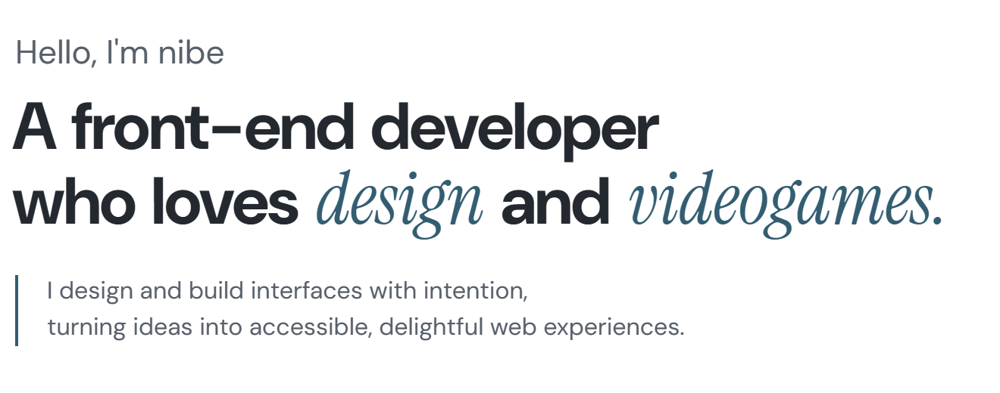
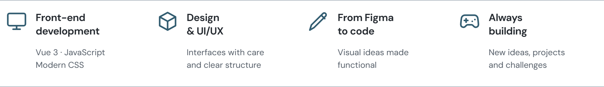
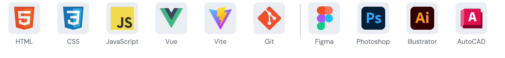
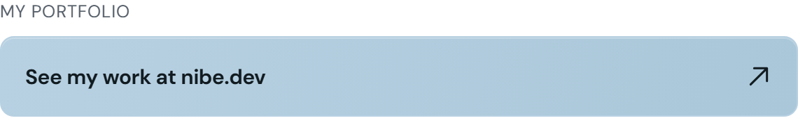
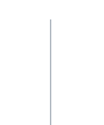
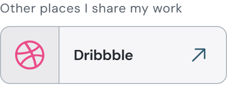
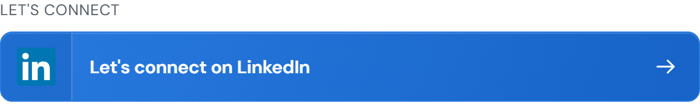
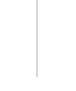
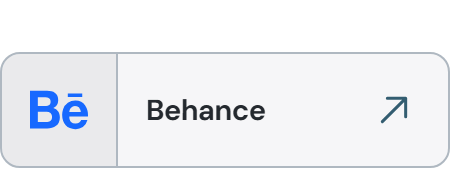

<!-- Profile repository: github.com/nibedev/nibedev -->

  <picture><source media="(prefers-color-scheme: dark)" srcset="./assets/intro.png"><source media="(prefers-color-scheme: light)" srcset="./assets/intro-light.png"></picture>

  <picture><source media="(prefers-color-scheme: dark)" srcset="./assets/features.png"><source media="(prefers-color-scheme: light)" srcset="./assets/features-light.png"></picture>

  <picture><source media="(prefers-color-scheme: dark)" srcset="./assets/technologies.png"><source media="(prefers-color-scheme: light)" srcset="./assets/technologies-light.png"></picture>

  <a href="https://www.nibe.dev/" aria-label="Explore nibe.dev portfolio"><picture><source media="(prefers-color-scheme: dark)" srcset="./assets/portfolio-button.png"><source media="(prefers-color-scheme: light)" srcset="./assets/portfolio-button-light.png"></picture></a><picture><source media="(prefers-color-scheme: dark)" srcset="./assets/button-divider-top.png"><source media="(prefers-color-scheme: light)" srcset="./assets/button-divider-top-light.png"></picture><a href="https://dribbble.com/nibedev" aria-label="View nibe on Dribbble"><picture><source media="(prefers-color-scheme: dark)" srcset="./assets/dribbble-button.png"><source media="(prefers-color-scheme: light)" srcset="./assets/dribbble-button-light.png"></picture></a> 
  <a href="https://www.linkedin.com/in/nibedev/" aria-label="Connect with nibe on LinkedIn"><picture><source media="(prefers-color-scheme: dark)" srcset="./assets/linkedin-button.png"><source media="(prefers-color-scheme: light)" srcset="./assets/linkedin-button-light.png"></picture></a><picture><source media="(prefers-color-scheme: dark)" srcset="./assets/button-divider-bottom.png"><source media="(prefers-color-scheme: light)" srcset="./assets/button-divider-bottom-light.png"></picture><a href="https://www.behance.net/nibedev" aria-label="View nibe on Behance"><picture><source media="(prefers-color-scheme: dark)" srcset="./assets/behance-button.png"><source media="(prefers-color-scheme: light)" srcset="./assets/behance-button-light.png"></picture></a>

<!-- To update the graphics, see PROFILE_SETUP.md. -->
